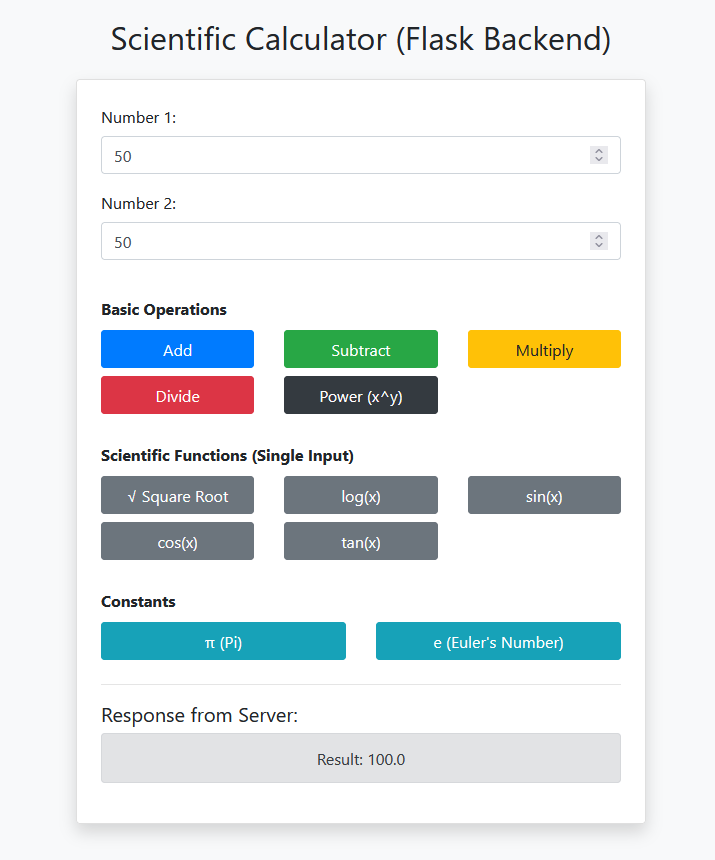

# 🔬 Scientific Calculator (Flask + HTML + JS)

This is a simple scientific calculator web app built using **Flask** (Python backend), **HTML/CSS** for UI, and **JavaScript** for communicating with the server. It supports basic arithmetic and scientific functions.

---

## 🚀 Features

- ✖️ Addition, Subtraction, Multiplication, Division
- 💥 Power (xy)
- √ Square Root
- log(x) – Logarithm
- sin(x), cos(x), tan(x)
- π and Euler's constant (e)
- Responsive UI with Bootstrap 4

---
Image of Application

---

## 🛠️ Project Structure

